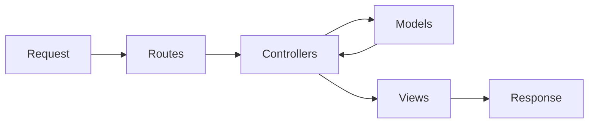

# BNB Couples

A boutique-style listings app for curated stays built with Express, EJS, and MongoDB.

## Highlights
- MVC architecture with controllers, routes, models, and views
- Authenticated listing creation and owner-only editing/deleting
- Custom design system and responsive UI
- Validation middleware for listings and reviews

## Architecture Flow


## Setup
1. Install dependencies:
   ```bash
   npm install
   ```
2. Copy environment variables:
   ```bash
   cp .env.example .env
   ```
3. Update `.env` with your credentials.
4. Start MongoDB locally or provide a cluster URI.
5. Run the app:
   ```bash
   node index.js
   ```
6. Open http://localhost:8080

## Environment Variables
- `PORT`
- `MONGO_URL`
- `SESSION_SECRET`
- `COOKIE_SECRET`

## Usage (Step-by-step)
1. Start the server.
2. Go to `/login`.
3. Log in with your user.
4. Create a new listing.
5. Edit or delete your own listings from the listing page.
6. Leave reviews on listing detail pages.

## Credits
Ayush Chakraborty — theayushchakraborty@gmail.com
